# Airbyte Data Ingestion Project Analysis & Template Creation

## Table of Contents
1. [Project Analysis Overview](#project-analysis-overview)
2. [Architecture Deep Dive](#architecture-deep-dive)
3. [Technology Stack](#technology-stack)
4. [Template Creation Plan](#template-creation-plan)
5. [Implementation Steps](#implementation-steps)
6. [Files Created](#files-created)
7. [Next Steps](#next-steps)

---

## Project Analysis Overview

### Original Request
The user requested a comprehensive analysis of an existing `dw-ingestion` project to understand:
- How the technology works
- How to use it in detail
- Create a new simplified template based on the analysis

### Project Purpose
The analyzed project is a **sophisticated data ingestion infrastructure** that automates ETL (Extract, Transform, Load) processes from various operational sources into a centralized data warehouse using:
- **Airbyte** (open-source ELT platform)
- **Terraform** (Infrastructure as Code)
- **Multi-environment deployment** (dev, stage, prod)

---

## Architecture Deep Dive

```mermaid
graph TD
    %% Data Sources
    subgraph "Data Sources"
        GS["📊 Google Sheets<br/>(HR Data, Forms)"]
        MYSQL["🗄️ MySQL Databases<br/>(CRM2, Time Tracker)"]
        S3["☁️ AWS S3<br/>(Comeet Data, Datalake)"]
        GCS["☁️ Google Cloud Storage<br/>(Meeting Data)"]
        FILE["📄 External Files<br/>(BOI Exchange Rates)"]
    end

    %% Airbyte Components
    subgraph "Airbyte Platform"
        SOURCES["📥 Airbyte Sources<br/>(50+ connectors)"]
        CONNECTIONS["🔄 Airbyte Connections<br/>(Data pipelines)"]
        DESTINATIONS["📤 Airbyte Destinations"]
    end

    %% Data Destinations
    subgraph "Data Warehouses"
        BQ["🏢 BigQuery<br/>(Main Data Warehouse)"]
        MILVUS["🔍 Milvus<br/>(Vector Database)"]
    end

    %% Terraform Infrastructure
    subgraph "Infrastructure as Code"
        TF["⚙️ Terraform<br/>(Infrastructure Management)"]
        WORKSPACES["🌍 Workspaces<br/>(dev, stage, prod)"]
        K8S["☸️ Kubernetes<br/>(Backend State)"]
    end

    %% Environment Management
    subgraph "Environment Management"
        ARGOCD["🚀 ArgoCD<br/>(GitOps Deployment)"]
        CROSSPLANE["🔧 Crossplane<br/>(State Management)"]
    end

    %% Data Flow Connections
    GS --> SOURCES
    MYSQL --> SOURCES
    S3 --> SOURCES
    GCS --> SOURCES
    FILE --> SOURCES

    SOURCES --> CONNECTIONS
    CONNECTIONS --> DESTINATIONS

    DESTINATIONS --> BQ
    DESTINATIONS --> MILVUS

    %% Infrastructure Connections
    TF --> WORKSPACES
    TF --> AIRBYTE_CONFIG["📋 Airbyte Configuration"]
    AIRBYTE_CONFIG --> SOURCES
    AIRBYTE_CONFIG --> CONNECTIONS
    AIRBYTE_CONFIG --> DESTINATIONS

    WORKSPACES --> K8S
    ARGOCD --> TF
    CROSSPLANE --> K8S
```



### Key Components Analyzed

#### 1. **Data Sources** (50+ configured)
- **Google Sheets**: 25+ employee/HR related sheets
- **MySQL Databases**: CRM2 and Time Tracker systems
- **AWS S3**: Comeet recruiting data, datalake documents
- **Google Cloud Storage**: Meeting logs and attendance data
- **External APIs**: Bank of Israel exchange rates

#### 2. **Destinations**
- **BigQuery**: Primary data warehouse with custom namespaces
- **Milvus**: Vector database for unstructured documents and AI/ML

#### 3. **Infrastructure Management**
- **Terraform**: Infrastructure as Code with modular architecture
- **Multi-environment**: dev, stage, prod, old-prod workspaces
- **Kubernetes**: Backend state management
- **ArgoCD**: GitOps deployment automation

---

## Technology Stack

### Core Technologies
1. **Airbyte v0.13.0** - Data integration platform
2. **Terraform** - Infrastructure automation
3. **Kubernetes** - Container orchestration & state management
4. **BigQuery** - Data warehouse
5. **Milvus** - Vector database

### Configuration Structure
```
ingestion/
├── main.tf                    # Module orchestration
├── variables.tf               # Global variables
├── locals.tf                  # Source definitions
├── locals.{env}.tf           # Environment-specific configs
├── providers.tf               # Provider configurations
├── sources/                   # Source modules
│   ├── google_sheets/
│   ├── mysql/
│   ├── s3/
│   └── gcs/
├── destinations/              # Destination modules
│   ├── bigquery/
│   └── milvus/
└── connections/               # Connection management
```

### Key Features Identified
- **Modular Architecture**: Each source/destination as separate module
- **Environment Isolation**: Workspace-based environment management
- **Automated Scheduling**: Cron-based sync schedules for production
- **State Management**: Kubernetes backend for distributed state
- **Security**: Service account based authentication

---

## Template Creation Plan

### User Requirements
- **Target Directory**: `/Users/shirel_lugasi/tikal-cne-data-platform/cne-airbyte-template/`
- **Scope**: Simplified S3 → BigQuery connection only
- **Environment**: Single environment (no multi-env complexity)
- **Credentials**: From AWS Secrets Manager `playground/airbyte`
- **Airbyte Instance**: `airbyte.k8s.localhost` (existing EKS cluster)
- **BigQuery Dataset**: `dwh-dev-414206.cne_ai_dataplatform_demo`

### Simplifications Made
1. **Single Environment**: No dev/stage/prod separation
2. **One Data Flow**: Only S3 → BigQuery
3. **Manual Scheduling**: No automated cron schedules
4. **Local State**: No Kubernetes backend complexity
5. **Basic Security**: Direct variable-based credentials

---

## Implementation Steps

### Step 1: Directory Structure Creation
```bash
mkdir -p /Users/shirel_lugasi/tikal-cne-data-platform/cne-airbyte-template/ingestion/{sources/s3,destinations/bigquery,connections}
```

### Step 2: Core Terraform Files

#### **providers.tf** - Provider Configuration
```hcl
terraform {
  required_providers {
    airbyte = {
      source  = "airbytehq/airbyte"
      version = "0.13.0"
    }
  }
}

provider "airbyte" {
  username   = var.AIRBYTE_USERNAME
  password   = var.AIRBYTE_PASSWORD
  server_url = var.AIRBYTE_SERVER_URL
}
```

**Purpose**: 
- Defines which external providers Terraform should use
- Configures authentication to Airbyte instance
- Uses variables for credentials (no hardcoding)
- Connects to `airbyte.k8s.localhost` as specified

---

## Files Created

### 1. **providers.tf** ✅
- **Status**: Created
- **Purpose**: Terraform provider configuration and Airbyte authentication
- **Key Features**: Variable-based authentication, version pinning

### Planned Files (To Be Created):

### 2. **variables.tf**
```hcl
variable "WORKSPACE_ID" {
  description = "Airbyte workspace ID"
  type        = string
}

variable "AIRBYTE_USERNAME" {
  description = "Airbyte username" 
  type        = string
}

variable "AIRBYTE_PASSWORD" {
  description = "Airbyte password"
  type        = string
}

variable "AIRBYTE_SERVER_URL" {
  description = "Airbyte server URL"
  type        = string
  default     = "http://airbyte.k8s.localhost"
}

variable "AWS_ACCESS_KEY_ID" {
  description = "AWS access key for S3"
  type        = string
}

variable "AWS_SECRET_ACCESS_KEY" {
  description = "AWS secret key for S3" 
  type        = string
}

variable "S3_BUCKET_NAME" {
  description = "S3 bucket name to sync from"
  type        = string
}

variable "BIGQUERY_PROJECT_ID" {
  description = "BigQuery project ID"
  type        = string
  default     = "dwh-dev-414206"
}

variable "SERVICE_ACCOUNT_JSON" {
  description = "GCP service account JSON for BigQuery"
  type        = string
}
```

### 3. **locals.tf**
```hcl
locals {
  # S3 Source Configuration
  s3_config = {
    aws_access_key_id     = var.AWS_ACCESS_KEY_ID
    aws_secret_access_key = var.AWS_SECRET_ACCESS_KEY
    bucket                = var.S3_BUCKET_NAME
    streams = [
      {
        name                            = "data_stream"
        days_to_sync_if_history_is_full = 3
        schemaless                      = false
        globs                           = ["*.csv", "*.json"]
        validation_policy               = "Emit Record"
        format = {
          csv_format = {
            delimiter = ","
            double_quote = true
            encoding = "utf8"
            quote_char = "\""
          }
        }
      }
    ]
  }

  # BigQuery Destination Configuration  
  bigquery_config = {
    credentials_json     = var.SERVICE_ACCOUNT_JSON
    project_id          = var.BIGQUERY_PROJECT_ID
    dataset_id          = "cne_ai_dataplatform_demo"
    dataset_location    = "US"
    loading_method = {
      standard_inserts = {}
    }
  }

  # Connection Configuration
  connection_config = {
    name                                 = "S3 to BigQuery"
    status                               = "active"
    namespace_definition                 = "destination"
    non_breaking_schema_updates_behavior = "ignore"
    schedule = {
      schedule_type   = "manual"
      cron_expression = ""
    }
    streams = [
      {
        sync_mode = "full_refresh_overwrite"
        name      = "data_stream"
        selected  = true
      }
    ]
  }
}
```

### 4. **main.tf**
```hcl
# S3 Source
module "s3_source" {
  source = "./sources/s3"
  
  configuration = local.s3_config
  workspace_id  = var.WORKSPACE_ID
  source_name   = "S3 Data Source"
}

# BigQuery Destination  
module "bigquery_destination" {
  source = "./destinations/bigquery"
  
  configuration = local.bigquery_config
  workspace_id  = var.WORKSPACE_ID
  destination_name = "BigQuery Destination"
}

# Connection
module "s3_to_bigquery_connection" {
  source = "./connections"
  
  source_id      = module.s3_source.source_id
  destination_id = module.bigquery_destination.destination_id
  connection_config = local.connection_config
}
```

### 5. **Module Files**

#### **sources/s3/main.tf**
```hcl
resource "airbyte_source_s3" "s3_source" {
  configuration = var.configuration
  workspace_id  = var.workspace_id
  name          = var.source_name
}
```

#### **destinations/bigquery/main.tf**
```hcl
resource "airbyte_destination_bigquery" "bigquery_destination" {
  configuration = var.configuration
  workspace_id  = var.workspace_id
  name          = var.destination_name
}
```

#### **connections/main.tf**
```hcl
resource "airbyte_connection" "s3_to_bigquery" {
  source_id                            = var.source_id
  destination_id                       = var.destination_id
  name                                 = var.connection_config.name
  status                               = var.connection_config.status
  namespace_definition                 = var.connection_config.namespace_definition
  non_breaking_schema_updates_behavior = var.connection_config.non_breaking_schema_updates_behavior
  
  configurations = {
    streams = var.connection_config.streams
  }
  
  schedule = var.connection_config.schedule
}
```

---

## Next Steps

### Immediate Actions Required:

1. **Complete File Creation**:
   - Finish creating all planned Terraform files
   - Create module variable and output files
   - Create terraform.tfvars.example

2. **Configure Credentials**:
   - Extract values from AWS Secrets Manager: `playground/airbyte`
   - Set up BigQuery service account for `dwh-dev-414206`
   - Configure Airbyte workspace ID

3. **Test Deployment**:
   ```bash
   cd /Users/shirel_lugasi/tikal-cne-data-platform/cne-airbyte-template/ingestion
   terraform init
   terraform plan
   terraform apply
   ```

### Documentation To Create:

1. **README.md**: Setup and usage instructions
2. **SETUP.md**: Detailed configuration guide
3. **TROUBLESHOOTING.md**: Common issues and solutions

### Integration Points:

- **Airbyte UI**: `airbyte.k8s.localhost`
- **BigQuery Console**: Monitor data ingestion
- **AWS S3**: Source data bucket configuration
- **Terraform State**: Local or remote state management

---

## Key Learnings from Analysis

1. **Modular Architecture**: Essential for maintainability and reusability
2. **Environment Separation**: Critical for production deployments
3. **Security**: Service account based authentication preferred
4. **Monitoring**: Integration with ArgoCD and Kubernetes for observability
5. **Scheduling**: Cron-based automation for production workloads

---

## Resources and References

- **Original Project**: `/Users/shirel_lugasi/dw-ingestion`
- **Airbyte Terraform Provider**: [Registry Link](https://registry.terraform.io/providers/airbytehq/airbyte/latest/docs)
- **AWS Secrets Manager**: [playground/airbyte secret](https://us-east-1.console.aws.amazon.com/secretsmanager/secret?name=playground%2Fairbyte&region=us-east-1)
- **BigQuery Dataset**: [cne_ai_dataplatform_demo](https://console.cloud.google.com/bigquery?referrer=search&project=dwh-dev-414206&ws=!1m4!1m3!3m2!1sdwh-dev-414206!2scne_ai_dataplatform_demo)

---

*This document serves as a complete reference for the Airbyte template creation project and can be shared with team members for collaboration and future development.*
