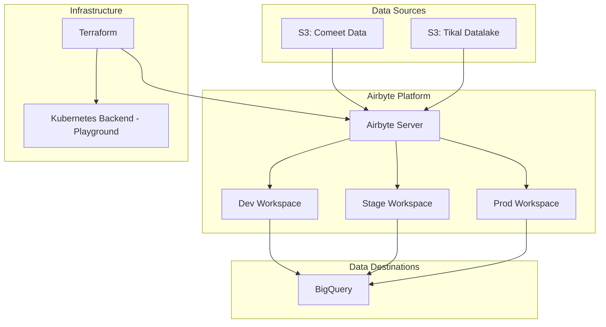

# 🚀 Airbyte Data Ingestion Template

[](https://terraform.io/)
[](https://airbyte.com/)
[](https://cloud.google.com/bigquery)
[](https://kubernetes.io/)

A comprehensive Infrastructure as Code (IaC) template for managing Airbyte data pipelines using Terraform. This template provides a scalable, multi-environment data ingestion solution with support for various data sources and destinations.

## 📋 Table of Contents

- [Overview](#-overview)
- [Architecture](#-architecture)
- [Features](#-features)
- [Prerequisites](#-prerequisites)
- [Quick Start](#-quick-start)
- [Configuration](#-configuration)
- [Data Sources](#-data-sources)
- [Data Destinations](#-data-destinations)
- [Environment Management](#-environment-management)
- [Usage Examples](#-usage-examples)
- [Troubleshooting](#-troubleshooting)
- [Contributing](#-contributing)

## 🔍 Overview

This template automates the deployment and management of Airbyte data ingestion pipelines using Terraform. It supports multiple data sources, destinations, and environments, making it ideal for organizations looking to implement scalable data integration solutions.

### Key Benefits

- **Infrastructure as Code**: Version-controlled, reproducible infrastructure
- **Multi-Environment Support**: Separate dev, staging, and production environments
- **Modular Design**: Reusable modules for sources, destinations, and connections
- **Scalable**: Easily add new data sources and destinations
- **Secure**: Proper secret management and authentication

## 🏗️ Architecture



### Component Overview

| Component | Purpose | Technology |
|-----------|---------|------------|
| **Sources** | Data ingestion from various systems | S3 (AWS) |
| **Destinations** | Data storage and processing | BigQuery |
| **Orchestration** | Pipeline management | Airbyte |
| **Infrastructure** | Resource provisioning | Terraform + Kubernetes |
| **State Management** | Infrastructure state | Kubernetes Secret Backend |

## ✨ Features

### 🔌 Data Sources
- **AWS S3**: Comeet recruiting data (CSV format) and tikal-datalake documents (unstructured format)

### 🎯 Data Destinations
- **BigQuery**: Data warehouse for analytics and reporting

### 🔧 Infrastructure Features
- Multi-environment workspace management
- Kubernetes-based state backend
- Modular Terraform architecture
- Automated resource naming and tagging
- Secret management integration

## 📋 Prerequisites

### Required Tools
- [Terraform](https://www.terraform.io/downloads.html) >= 1.0
- [kubectl](https://kubernetes.io/docs/tasks/tools/install-kubectl/) configured with cluster access
- Access to Airbyte server instance
- Cloud provider credentials (GCP, AWS)

### Required Access
- Kubernetes cluster with "playground" context configured
- Airbyte server with API access
- Google Cloud Platform project with BigQuery API enabled
- AWS account with S3 access for Comeet and tikal-datalake buckets

## 🚀 Quick Start

### 1. Clone the Repository
```bash
git clone <repository-url>
cd cne-airbyte-template
```

### 2. Configure Environment Variables
```bash
cp terraform.tfvars.example terraform.tfvars
```

Edit `terraform.tfvars` with your configuration:
```hcl
WORKSPACE_ID                        = "your-airbyte-workspace-id"
USERNAME                            = "your-airbyte-username"
PASSWORD                            = "your-airbyte-password"
SERVER_URL                          = "https://your-airbyte-server.com"
SERVICE_ACCOUNT_INFO                = "your-gcp-service-account-json"
BIGQUERY_PROJECT_ID                 = "your-bigquery-project-id"
# ... additional variables
```

### 3. Initialize Terraform
```bash
terraform init -backend-config=backend-config/config.k8s.tfbackend
```

### 4. Select Environment
```bash
# For development
terraform workspace select cne-airbyte-template-dev

# For staging
terraform workspace select cne-airbyte-template-stage

# For production
terraform workspace select cne-airbyte-template-prod
```

### 5. Deploy Infrastructure
```bash
terraform plan -var-file=terraform.tfvars
terraform apply -var-file=terraform.tfvars
```

## ⚙️ Configuration

### Environment Variables

| Variable | Description | Required |
|----------|-------------|----------|
| `WORKSPACE_ID` | Airbyte workspace identifier | ✅ |
| `USERNAME` | Airbyte username | ✅ |
| `PASSWORD` | Airbyte password | ✅ |
| `SERVER_URL` | Airbyte server URL | ✅ |
| `SERVICE_ACCOUNT_INFO` | GCP service account JSON | ✅ |
| `BIGQUERY_PROJECT_ID` | BigQuery project ID | ✅ |
| `AWS_ACCESS_KEY_ID` | AWS access key | ✅ |
| `AWS_SECRET_ACCESS_KEY` | AWS secret key | ✅ |

### Workspace Configuration

The template uses Terraform workspaces to manage environments:

```bash
# Create new workspace
terraform workspace new cne-airbyte-template-dev

# List workspaces
terraform workspace list

# Switch workspace
terraform workspace select cne-airbyte-template-prod
```

## 📊 Data Sources

### S3 Sources

Currently configured S3 sources:

- **comeet_all_candidate**: Candidate information from Comeet recruiting platform with detailed CSV schema
- **comeet_all_candidate_steps**: Candidate workflow steps and process data
- **tikal-datalake-dev**: Unstructured documents including:
  - Employee markdown files from GitLab sync
  - Engineering playbooks in HTML format

## 🎯 Data Destinations

### BigQuery

Primary data warehouse with:
- Custom dataset organization using namespace formatting from `source_table_names.json`
- Environment-specific dataset naming
- Standard insert loading method with 15MB buffer size
- Located in `europe-central2` region
- Supports both structured CSV and unstructured document data

## 🌍 Environment Management

### Environment Structure

Each environment has its own:
- Terraform workspace (`cne-airbyte-template-{env}`)
- Airbyte workspace
- BigQuery datasets
- Resource naming conventions

### Connection Configuration

Connections are defined per environment in `locals.{env}.tf`:

```hcl
# Example connection configuration
"comeet_all_candidate → ${local.BIGQUERY_NAME_DEV}" = {
  source_id                            = module.s3_source["comeet_all_candidate"].source_id
  destination_id                       = module.bigquery_destination.destination_id
  status                               = "active"
  non_breaking_schema_updates_behavior = "ignore"
  namespace_definition                 = "custom_format"
  namespace_format                     = local.namespace_formats["sources_comeet"]
  schedule = {
    schedule_type   = "manual"
    cron_expression = ""
  }
  streams = [
    {
      sync_mode = "full_refresh_overwrite"
      name      = "all_candidates"
      selected  = true
    }
  ]
}
```

## 💻 Usage Examples

### Adding a New S3 Source

1. Add the configuration to `locals.tf`:
```hcl
"new_s3_source" = {
  configuration = {
    aws_access_key_id     = var.AWS_ACCESS_KEY_ID
    aws_secret_access_key = var.AWS_SECRET_ACCESS_KEY
    bucket                = "your-s3-bucket"
    streams = [
      {
        name                            = "your_data"
        days_to_sync_if_history_is_full = 3
        schemaless                      = false
        globs                           = ["path/to/your/files/*.csv"]
        input_schema                    = "{\"field1\": \"string\", \"field2\": \"number\"}"
        validation_policy               = "Emit Record"
        format = {
          "csv_format" = {
            # CSV format configuration
          }
        }
      }
    ]
  }
  workspace_id = local.workspace_id
}
```

2. Add the connection in `locals.dev.tf` (and other environments):
```hcl
"new_s3_source → ${local.BIGQUERY_NAME_DEV}" = {
  source_id      = module.s3_source["new_s3_source"].source_id
  destination_id = module.bigquery_destination.destination_id
  # ... other configuration
}
```

3. Add namespace format in `source_table_names.json`:
```json
{
  "sources_new_s3": "sources_new_s3"
}
```

### Deploying Specific Resources

```bash
# Deploy only BigQuery destination
terraform apply -target=module.bigquery_destination

# Deploy specific S3 source
terraform apply -target=module.s3_source["comeet_all_candidate"]

# Deploy all connections
terraform apply -target=module.connections
```

### Managing State

```bash
# View state
terraform state list

# Import existing resource
terraform import module.bigquery_destination.airbyte_destination_bigquery.destination <resource-id>

# Remove resource from state
terraform state rm module.old_source.airbyte_source_s3.source
```

## 🔧 Troubleshooting

### Common Issues

#### Authentication Errors
```bash
Error: failed to create Airbyte client: authentication failed
```
**Solution**: Verify `USERNAME`, `PASSWORD`, and `SERVER_URL` in `terraform.tfvars`

#### Workspace Not Found
```bash
Error: workspace "cne-airbyte-template-dev" does not exist
```
**Solution**: Create the workspace first:
```bash
terraform workspace new cne-airbyte-template-dev
```

#### BigQuery Permission Denied
```bash
Error: googleapi: Error 403: Access Denied
```
**Solution**: Ensure the service account has BigQuery Data Editor and Job User roles

#### State Lock Issues
```bash
Error: state lock acquired by another process
```
**Solution**: Force unlock (use with caution):
```bash
terraform force-unlock <lock-id>
```

### Debug Mode

Enable detailed logging:
```bash
export TF_LOG=DEBUG
terraform plan -var-file=terraform.tfvars
```

### Validation

Validate configuration before applying:
```bash
terraform validate
terraform fmt -check
```

## 🤝 Contributing

### Development Workflow

1. **Fork the repository**
2. **Create a feature branch**: `git checkout -b feature/new-source`
3. **Make changes**: Add new modules or modify existing ones
4. **Test changes**: Validate with `terraform plan`
5. **Submit a pull request**

### Code Standards

- Use consistent naming conventions
- Add appropriate comments and documentation
- Follow Terraform best practices
- Test in development environment first

### Adding New Modules

When adding new source or destination modules:

1. Create module directory: `sources/new-source/` or `destinations/new-destination/`
2. Add `main.tf`, `variables.tf`, and `outputs.tf`
3. Update root `main.tf` to include the new module
4. Add environment-specific configurations in `locals.{env}.tf`
5. Update documentation

---

## 📄 License

This project is licensed under the MIT License - see the [LICENSE](LICENSE) file for details.

## 🆘 Support

For support and questions:
- Create an issue in this repository
- Check the [CLAUDE.md](CLAUDE.md) file for technical details
- Refer to [Airbyte documentation](https://docs.airbyte.com/)
- Consult [Terraform documentation](https://registry.terraform.io/providers/airbytehq/airbyte/latest/docs)

---

**Happy Data Engineering!** 🎉